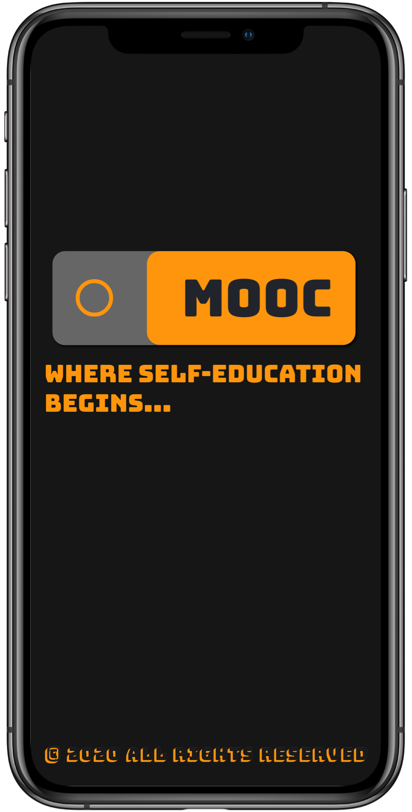
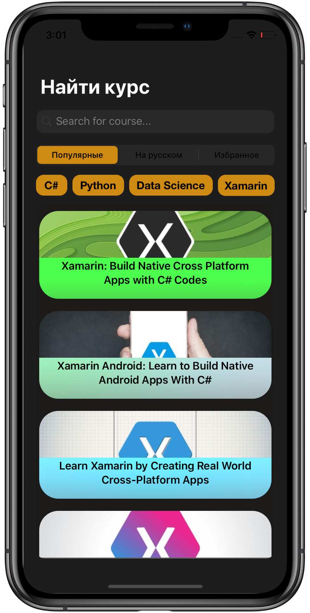

# MOOC-iOS-App
>Where self-education begins..

## Introduction
My first project as a first-year student of the FCS HSE. Project contains two parts: 
* Server (Deployed on Linux, Unbuntu 18.04)
* Client (Xamarin.IOS project)

The connection between server and client is implemented via .Net Core Web Api. Server is rented on the [platform](ruvds.com) until 26.05.2020
***

***

## Functions
* Make a recommendation based on a user's request
* Possibility to add courses to favourites
* Possibility to delete courses from favourites
* Show popular on aggregated online platforms courses
* Show popular on aggregated online platforms courses 
only on russian
* Show detailed information about specific course
***

## Used technologies and libraries
* C# (condition)
* Xamarin.IOS (condition)
* .Net Core 3.1
* MySQL data base
* AngleSharp Library
* Newtonsoft Library
* NLog Config
* Nginx
***

## Aggregated Online Platforms
* Stepik.org (via API)
* Coursera.org (using HTML-Parsing)
* Udemy.com (via API)

***
## Target operating system
* IOS-13 or later
***
## Installation
* Local Server (Windows required)
    * Download the project 
    * Unpack the project
    * Open MOOC_Server.exe
* App (macOS, Visual Studio and XCode required)
    * Open MOOC.sln
    * Build project (mode: Release)
***
>The journey is the reward (c) Steve Jobs

